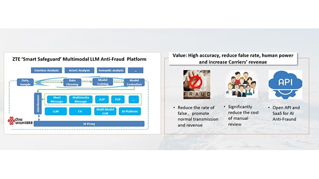

# ZTE Smart Safeguard：业界首个基于多模态大模型的短信反欺诈系统

**来源**: Mobile World Live / ZTE 官方新闻  
**发布时间**: 2024年11月13日（系统于2023年10月正式发布）  
**合作方**: 中兴通讯（ZTE）+ 中国联通  
**荣誉**: 荣获工业和信息化部反诈工作专班"2023年电信反诈创新技术"最高奖  
**参考链接**: https://www.mobileworldlive.com/china-unicom-and-zte-launch-multimodal-llm-enhanced-message-anti-fraud-solution/

## 系统概述

Smart Safeguard 是电信行业首个基于 AI 多模态大语言模型（MLLM）的反欺诈系统。能够分析和处理多种媒体类型，包括**文本、图像、音频和视频**，综合运用大语言模型、计算机视觉模型和混合多模态模型。

## 核心技术特点

### 1. 多模态内容分析
- 支持文本、图像、音频、视频等多种短信内容格式
- 综合运用 LLM + CV（计算机视觉）+ 混合多模态模型

### 2. 多语言支持
- 支持英语、法语、西班牙语、中文、缅甸语、闽南语、粤语等多种语言

### 3. 动态自我升级
- 无需人工策略配置，全自动化工作流
- 支持数据清洗、导入、训练、推理的全流程自动化
- 自主迭代闭环服务，无需人工干预即可持续更新系统能力

### 4. 高性能架构
- 大模型 + 负载均衡架构，支持高容量、高并发服务处理
- 混合大小模型的多层串并行部署，在提升性能的同时降低 AI 算力成本
- 增量微调能力，推理准确率稳定保持在 **95% 以上**

### 5. 安全与互操作性
- 个人数据不离网，保护用户隐私
- 全冗余架构，业务推理采用负载均衡 N+1 架构
- 通过标准接口与任意运营商网络无缝集成
- 支持开放 API 架构，向 ToC 和 ToB 用户提供能力分析 API
- 已被推荐纳入 GSMA Open Gateway 倡议

## 商业部署效果

- 2023年7月在中国多个省份商业部署
- 中国联通江苏分公司部署后：
  - 欺诈检测预测准确率和召回率均超过 **95%**
  - 与传统系统相比，错误率大幅降低
  - 降低传统系统维护和人工审核成本
  - 减少误拦截，增加收入
- 早期版本（2024年前）：垃圾和欺诈短信的日均拦截成功率从 **57.25% 提升至 93.60%**，误拦截率大幅下降

## 行业背景

根据 GASA（全球反诈联盟）2023年报告：
- 全球网络诈骗损失约 **102万亿美元**，相当于全球 GDP 的 1.05%
- 2022年损失为 553亿美元，一年内急剧增加
- 电信（包括 SMS/MMS 和语音/视频通话）用户约 **93亿**，是网络诈骗的主要目标

## 传统方案的局限性

- 基于静态规则，业务上线周期长
- 无法动态适应新型欺诈战术
- 识别能力低、效率低，人工成本不断增加

## 对 AgenticX-AiSMS 的启示

1. **多模态处理能力** 是未来短信安全的必然方向，不能只处理文本，还需要处理短信中的图片链接、嵌入图片等
2. **动态自我升级（闭环学习）** 是关键竞争力，AgenticX 的 Memory 模块可以支持这一能力
3. **增量微调** 可以让模型持续适应新型欺诈手法，而无需从头训练
4. **开放 API 架构** 是商业化的关键，AgenticX-AiSMS 应从一开始就设计好对外暴露的 API 接口
5. **95%+ 准确率** 是行业基准，AgenticX-AiSMS 需要达到或超越这一水平

## 架构图

